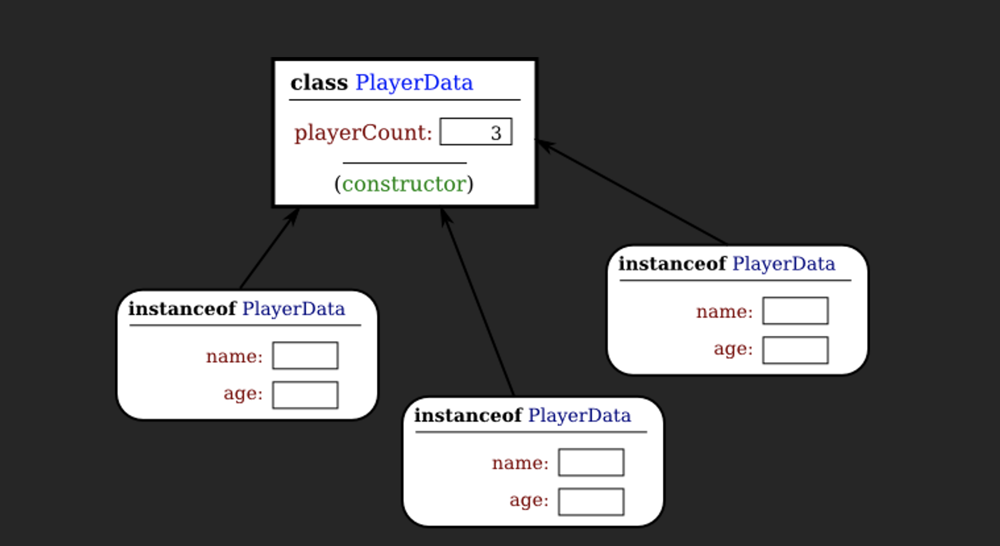

## Prerequisites:

- MacOS, Linux, Windows
- [Docker Desktop](https://www.docker.com/products/docker-desktop/) (once installed it can run all of our commands, or we can use the CLI)
- WSL2 if on Windows
- VS Code

## Installation:

MacOS:
- Download [Docker Desktop](https://www.docker.com/products/docker-desktop/)
- Go through the Docker Desktop installation process
- Open Docker Desktop and terminal
- Continue to Check Install

Windows:
- Open Powershell as admin
- Run ```wsl --install``` in powershell
- Install [Windows Terminal](https://apps.microsoft.com/store/detail/windows-terminal/9N0DX20HK701?hl=en-us&gl=us)
- Open Windows Terminal
- Download [Docker Desktop](https://www.docker.com/products/docker-desktop/)
- Go through the Docker Desktop installation process
- Open Docker Desktop
- Continue to Check Install (run commands in your Windows Terminal)

Linux:

- Run this command in the terminal:
```
sudo snap install docker 
```
- Continue to Check Install

## Check Install:

```
docker ps 
```
```
docker version
```
```
docker run hello-world
```
To show all running containers (the -a here is a tag meaning 'all'):
```
docker ps -a
```
One last example:
```
docker run docker/whalesay cowsay Hello there!
```
If the docker image doesn't exist locally, then docker will automatically pull it from [dockerhub](https://hub.docker.com/)

[Here](https://hub.docker.com/r/docker/whalesay) are some more details on whalesay.

## What is Docker?

Docker is a software platform used to build and run applications independent of the host operating system. It uses isolated containers to run and build code, so that it can run on any system that has Docker installed.

Docker is a way of running containers with specific coding packages/libraries pre-installed in them. Unlike a virtual environment which can have different packages from MacOS, to Windows, or Linux, Docker creates its own OS (usually linux) with all the packages installed, so that anyone, on any OS, can run your program or workspace. 

The major difference between a VM (vitual machine) and a Docker Container is that a container only runs one process, and once that process exits, the container exits. A VM can run many processes, as it is a virtual operating system. Because of this, a Docker container is very lightweight compared to a full VM.

### Benefits
-	Lightweight: compared to VMs, it only has what it needs to run the application, whereas a VM has to copy full-scale OS. This results in less storage used and usually better performance
-	Portability: easy to share applications with others
-	Solution to the problem: “It works on my machine…” 

### What are images and containers?
Images are a read-only template with instructions to create a container. They are immutable, which means they can’t be changed.

Containers are isolated environments used to run and build applications. They contain everything needed to run the application, so that it will work on any device and OS.

| Images = Sand bags<br>&<br>Containers = Sandbox | Images = Blueprint<br>&<br>Containers = Materialized Blueprint | Images = Classes<br>&<br>Containers = Class Instances |
|:------------------------:|:--------------------------:|:------------------------:|
|  |  |  |

## Why Docker for Data Science

Creating Reproducable code is one of the biggest problems people can face. The classic example of this is, "it works on my machine" which is caused by dependencies and need for the data that was used. As a data scientist you may be working on a project with team members where you need to share your work. Unlike Jupyter notebooks, containers, through docker, enable one to share code or a model along with the data by creating an environment that enables everything to work. Another example would be publishing work done in a research paper. Containers will allow one to communicate work creating the ability for others to audit the work. All the individual has to do is install docker. 

[Video 1](https://www.youtube.com/watch?v=oO8n3y23b6M)
Some of the benefits discussed: 
- Seperate out projects
- Create a container to onboard new employees
- Easy to upgrade dependencies 
  - build automated testing pipeline

[Video 2](https://www.youtube.com/watch?v=0qG_0CPQhpg&ab_channel=AbhishekThakur)

[ML pipelines and kubernetes](https://www.youtube.com/watch?v=lAAeJDcoHKY&t=734s&ab_channel=KrishNaik)

[Article explaining why docker is useful](https://www.projectpro.io/article/docker-for-data-science-applications/584#:~:text=Dockers%20allow%20users%20to%20connect,can%20smoothly%20contribute%20to%20them.)
- "It allows them to smoothly scale and deploy machine learning and deep learning applications."

## Basic Workflow

Build, run, push, pull.

### Important Terms

**Image**:
"A Docker image is a file used to execute code in a Docker container. Docker images act as a set of instructions to build a Docker container, like a template. Docker images also act as the starting point when using Docker." [More Reading](https://www.techtarget.com/searchitoperations/definition/Docker-image#:~:text=A%20Docker%20image%20is%20a,virtual%20machine%20(VM)%20environments.)

**Container**:
"A Docker container is an open source software development platform. Its main benefit is to package applications in containers, allowing them to be portable to any system running a Linux or Windows operating system (OS)."[More Reading](https://www.sdxcentral.com/cloud/containers/definitions/what-is-docker-container/#:~:text=A%20Docker%20container%20is%20an,a%20virtual%20machine%20(VM).)

You run an image to create a container. You do coding work inside of a container.

### Build

Every docker image we used above was built by someone. The build command is used to build your own custom image based on a Dockerfile. 

You can see all of the images you have downloaded locally using this command:
```
docker images
```

[Docker Build Docs](https://docs.docker.com/engine/reference/commandline/build/)

### Run

We've already used the ```docker run``` command. This command runs the image specified. An image can either run a specified file it contains (a deployed app, like the examples above) or it can open a web-server for development, which is what we will be doing. 

[Docker Run Docs](https://docs.docker.com/engine/reference/commandline/run/)

### Push

If you want to make your own dockerhub account you can push any images your make using the ```docker push image_name``` command. (this is beyond the scope of this tutorial.)

[Docker Push Docs](https://docs.docker.com/engine/reference/commandline/push/)

### Pull

The ```docker pull image_name``` command allows you to pull any prebuilt image from dockerhub. 

This is useful if you already know the language your project will be in, as you can then just pull an image that contains that language. Popular images can be found by browsing [dockerhub](https://hub.docker.com/). 

[Additional Reading](https://medium.com/@deepakshakya/beginners-guide-to-use-docker-build-run-push-and-pull-4a132c094d75)

[Docker Pull Docs](https://docs.docker.com/engine/reference/commandline/pull/)

## All-Spark-Notebook Image

In our tutorial we will use the [all-spark-notebook image](https://hub.docker.com/r/jupyter/all-spark-notebook). This image contains Python, R, Spark, Jupyter, Pandas, and many other useful data-science libraries.  

1. Navigate to the directory you want to use your notebook in.
2. In a command prompt (or terminal) run ```docker pull jupyter/all-spark-notebook```
3. Run:
```docker run -it --rm -p 8888:8888 -v "${PWD}":/home/jovyan/work jupyter/all-spark-notebook``` (MacOS/Linux)
3. Run:
```docker run -it --rm -p 8888:8888 -v "$(pwd):/home/jovyan/work" jupyter/all-spark-notebook``` (Windows)

The ```-it``` flag instructs Docker to allocate a pseudo-TTY connected to the container’s stdin; creating an interactive bash shell in the container. I remeber this as 'integrated terminal'.

The ```--rm``` flag automatically removes the container when it exits.

The ```-p 8888:8888``` flag is telling docker to bind the port 8888 of the container to you local port 8888.

The ```-v``` flag mounts the current working directory into the container. We are telling it to mount ```"${PWD}"``` (which gets our current directory) into the notebooks ```/home/jovyan/work``` directory. This allows the container to save the work being done in the container to a local directory as well.

If you close a server after working and then come back and start a new server your previous work should still be there because of the -v flag.

All of this can also be done from the Docker Desktop app. You can also remove the --rm command if you do not want the container to be cleared after every run. 

## Building Our Own Image

- Open VS Code
- Open the folder you want to code in
- Create a ```requirements.txt``` file
  - In the file paste ```pandas==1.5.1```
  - If unsure what version of libraries you are using, run the ```pip list``` command in your development environment.
- Create a python file ```main.py```
  - Paste the code:
```
import pandas as pd

url = 'https://raw.githubusercontent.com/cs109/2014_data/master/countries.csv'
data = pd.read_csv(url)

print(data.head())
```
- Create a file named ```Dockerfile```
  - Paste the following in the Dockefile:
```
FROM python:3
ADD requirements.txt /
RUN pip install -r requirements.txt
ADD main.py /
CMD [ "python", "./main.py" ]
```

- Finally run this code:
```
docker build -t user_name/python-script:latest .
```

The ```-t``` flag allows for a name and optionally a tag in the 'name:tag' format.

The ```.``` at the end says to use the current directory to find all the files to build the image.

- You can test your new image by running:
```
docker run user_name/python-script:latest
```

## Container

If you have already created a container using ```docker run [*flags] image-name``` then you can start one by using the ```docker start container-name``` command. 

You can use the ```docker container ls -a``` command to view all containers (not just running ones) if you forget the container name.

## Sharing Work

There are two ways to save and share a docker image. The first is using Docker Hub, and the second is creating a tarball. 

__Using Docker Hub__

* If you haven't already, creater a Docker Hub account
* Run the following command in the terminal, and log in:
```
sudo docker login
```
* Build your image:
```
sudo docker build -t my-account/my-image:latest .
```
* Push your image to the Docker Hub:
```
sudo docker push my-account/my-image:latest
```

Your image is now stored on Docker Hub and accessible to others. Try pulling one created earlier to test it out:

```
docker run brytonpetersen/good_job
```

__Creating a Tarball__

* Run the following:
```
sudo docker save my-account/my-image:latest > my-image.tar
```

* De-tar it using:
```
tar -xf my-image.tar
```

## Sources:

- [bag_image](https://cdn.w600.comps.canstockphoto.com/garbage-bag-icon-simple-style-image_csp74989470.jpg)
-	[sandbox_image](https://media.istockphoto.com/vectors/sandbox-icon-black-sign-with-color-and-inverted-versions-vector-id868486692?k=20&m=868486692&s=612x612&w=0&h=54bwlDESpbgXfl9d9Fvj7Pd79SQnvMms9fngiMGuPsY=)
-	[blueprint_image](https://graphicriver.img.customer.envatousercontent.com/files/167017373/blueprint_generator_preview.jpg?auto=compress%2Cformat&fit=crop&crop=top&w=590&h=590&s=fbd76f6dc754d0c57a1a87d8c0ce3dc3)
-	[thumbsup_image](https://upload.wikimedia.org/wikipedia/commons/6/67/Facebook_logo_thumbs_up_like_transparent.png)
-	[classes_image](https://math.hws.edu/javanotes/c5/instance-of-PlayerData.png)

